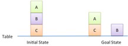

# Tutorial 1 : Real World Planning and Acting

> National University of Singapore · School of Computing  
> CS4246/CS5446 Reinforcement Learning and Sequential Decision Making  
> Semester 1, AY2026-27 · Issued: 19 Aug 2026

## Problem 1 – A Blocks World

Consider a blocks-world as shown in the figure below. The objective of this problem, called Middle-pop, is to remove the block $B$ in-between two other blocks, $A$ and $C$, and put it on the Table (represented by the horizontal line).

**a.** Express the blocks-world problem as a planning problem in the Planning Domain Definition Language (PDDL). You may use the following assumptions, and/or make additional assumptions as necessary:

- There are only four objects in the world – Block $A$, Block $B$, Block $C$, and the Table.
- A set of predicates define the descriptions of and the relations among the objects:
  - A block can be on top of another object, i.e., $On(x, y)$, where $x$ is a block and $y$ is another object.
  - The top of the object to be clear, i.e., $Clear(x)$, where $x$ is an object, before another object can be placed on top of it.
  - You can define additional predicates if necessary.
- A set of action schema and actions define how to change the world state:
  - A block can be re-arranged by moving it to (the top of) another object, i.e., $Move(x, fr, to)$, where $x$ is a block, and $fr$, $to$ are other objects in the world.
  - A block can be moved only when it is not stacked upon, i.e., it is “clear” on the top, or $Clear(x)$, where $x$ is a block.
  - You cannot move the Table, but you can always move something to or from the Table, i.e., $Clear(Table)$ is always assumed to be True (interpreted as: there is always “clear space” on the Table).
  - You can define additional action schemas or actions as necessary.

**b.** Show the search tree for planning by forward search.

**c.** Show a valid plan for the problem.

### Solution

> _Solution placeholder: write your answers to all three sub-questions here._

## Problem 2 – Heuristic for Planning

In classical planning, suppose goals and action preconditions are restricted to positive literals. Explain why removing all negative effects from every action schema results in a relaxed problem. Does this still hold if negative preconditions or goals are allowed?

### Solution

> _Solution placeholder: write your answer here._

## Problem 3 – Hierarchical Task Planning

Context We consider a hierarchical task planning problem where the world is described by five fluents: $A$, $B$, $C$, $D$, $E$. Each fluent can be true (positive) or false (negative).

The following primitive actions are available:

- $Action(P1, Precond: \neg A, Effect: A)$
- $Action(P2, Precond: A, Effect: B)$
- $Action(P3, Precond: A, Effect: \neg B)$
- $Action(P4, Precond: \neg B, Effect: A \land C)$
- $Action(P5, Precond: \neg B, Effect: C)$
- $Action(P6, Precond: \neg B, Effect: A \land \neg C)$
- $Action(P7, Precond: \neg B, Effect: \neg C)$
- $Action(P8, Precond: \neg B \land \neg C, Effect: D)$
- $Action(P9, Precond: D, Effect: E)$
- $Action(P10, Precond: \neg B \land D, Effect: E)$

### Notation

- $\land$ means logical conjunction.
- $\neg$ means logical negation.
- $\sim^+$ denotes “possibly add”, $\sim^-$ denotes “possibly delete”, $\sim^{\pm}$ denotes “possibly add or delete”.
- $[P1, P2, \ldots]$ denotes a sequence of primitive actions (or an HLA implementation).

**A)** Define schemas for the following higher-level actions (HLAs), with their preconditions, effects, and possible implementations.

**i.** $Action(H1, Precond: \neg A, Effect: \underline{\hspace{2.7cm}})$  
Possible implementations:
- $[P1, P2]$
- $[P1, P3]$

**ii.** $Action(H2, Precond: \underline{\hspace{2.7cm}}, Effect: \underline{\hspace{2.7cm}})$  
Possible implementations:
- $[P4]$
- $[P5]$
- $[P6]$
- $[P7]$

**iii.** $Action(H3, Precond: \underline{\hspace{2.7cm}}, Effect: D \land E)$  
Possible implementations:
- $[P8, P9]$
- $[P8, P10]$

**B)** Consider the planning problem:

- Initial state: $\neg A \land B$
- Goal state: $E$

Assuming negative literals are allowed in the initial state (closed world assumption), determine which sequences of HLAs with their implementations achieve the goal. Choose all that apply.

**i.** $H1 (P1,P3), H2 (P6), H3 (P8,P9)$  
**ii.** $H1 (P1,P3), H2 (P7), H3 (P8,P10)$  
**iii.** $H1 (P1,P2), H2 (P4), H3 (P8,P9)$  
**iv.** $H1 (P1,P2), H2 (P5), H3 (P8,P9)$

### Solution

> _Solution placeholder: write your answers to all parts of Problem 3 here._