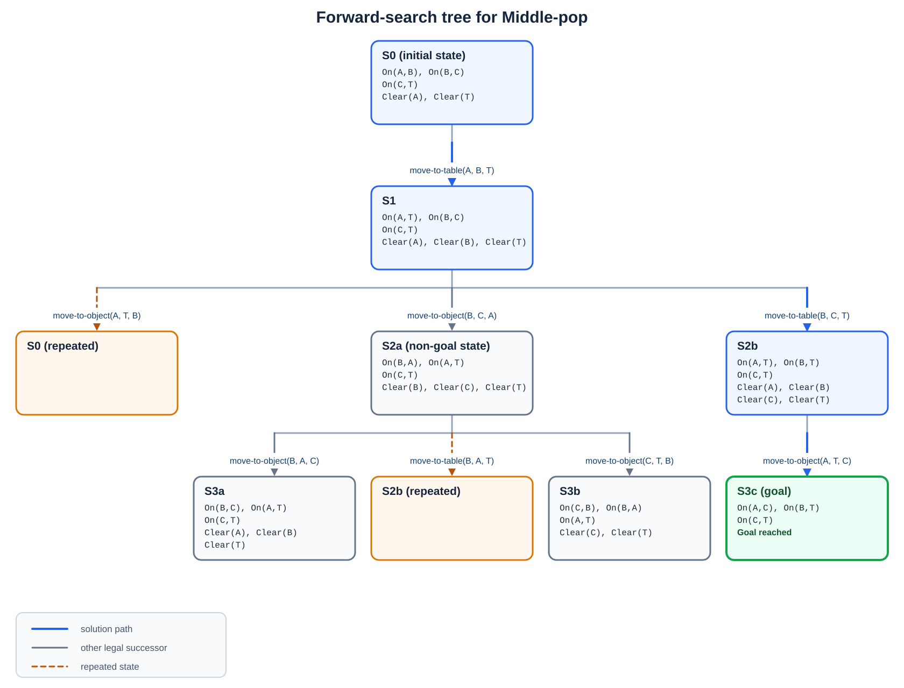

# Tutorial 1 : Real World Planning and Acting

> National University of Singapore · School of Computing  
> CS4246/CS5446 Reinforcement Learning and Sequential Decision Making  
> Semester 1, AY2026-27 · Issued: 19 Aug 2026

## AI Assistance Declaration

> ChatGPT was used to help convert handwritten draft solutions into Markdown and to recreate hand-drawn figures as computer-generated diagrams.  I remain responsible for the accuracy, originality, and final content of this submission.

## Problem 1 – A Blocks World

Consider a blocks-world as shown in the figure below. The objective of this problem, called Middle-pop, is to remove the block $B$ in-between two other blocks, $A$ and $C$, and put it on the Table (represented by the horizontal line).


**a.** Express the blocks-world problem as a planning problem in the Planning Domain Definition Language (PDDL). You may use the following assumptions, and/or make additional assumptions as necessary:

- There are only four objects in the world – Block $A$, Block $B$, Block $C$, and the Table.
- A set of predicates define the descriptions of and the relations among the objects:
  - A block can be on top of another object, i.e., $On(x, y)$, where $x$ is a block and $y$ is another object.
  - The top of the object to be clear, i.e., $Clear(x)$, where $x$ is an object, before another object can be placed on top of it.
  - You can define additional predicates if necessary.
- A set of action schema and actions define how to change the world state:
  - A block can be re-arranged by moving it to (the top of) another object, i.e., $Move(x, fr, to)$, where $x$ is a block, and $fr$, $to$ are other objects in the world.
  - A block can be moved only when it is not stacked upon, i.e., it is “clear” on the top, or $Clear(x)$, where $x$ is a block.
  - You cannot move the Table, but you can always move something to or from the Table, i.e., $Clear(Table)$ is always assumed to be True (interpreted as: there is always “clear space” on the Table).
  - You can define additional action schemas or actions as necessary.

**b.** Show the search tree for planning by forward search.

**c.** Show a valid plan for the problem.

### Solution

#### a) PDDL Model


```pddl
(define (domain middle-pop)
  (:requirements :strips :typing)
  (:types block surface - object)
  (:predicates
    (on ?x - block ?y - object)
    (clear ?x - object)
  )

  (:action move-to-object
    :parameters (?x - block ?from - object ?to - block)
    :precondition (and (on ?x ?from) (clear ?x) (clear ?to))
    :effect (and (not (on ?x ?from)) (on ?x ?to) (clear ?from) (not (clear ?to)))
  )

  (:action move-to-table
    :parameters (?x - block ?from - object ?to - surface)
    :precondition (and (on ?x ?from) (clear ?x))
    :effect (and (not (on ?x ?from)) (on ?x ?to) (clear ?from))
  )
)

(define (problem middle-pop-instance)
  (:domain middle-pop)

  (:objects
    a b c - block
    table - surface
  )

  (:init
    (on a b)
    (on b c)
    (on c table)
    (clear a)
    (clear table)
  )

  (:goal
    (and (on a c) (on b table))))
```

#### b) Forward-search tree



*Figure 1: Forward search from the initial state. The search stops after generating the first goal state at depth 3; the non-solution branch returns to an already visited state and is not expanded.*
#### c) Valid plan

A valid plan is:

```pddl
(move-to-table a b table)
(move-to-table b c table)
(move-to-object a table c)
```

## Problem 2 – Heuristic for Planning

In classical planning, suppose goals and action preconditions are restricted to positive literals. Explain why removing all negative effects from every action schema results in a relaxed problem. Does this still hold if negative preconditions or goals are allowed?

### Solution

#### Part 1: Positive Preconditions and Goals

Let $S_{\mathrm{old}}$ and $S_{\mathrm{new}}$ be the sets of solutions to the original problem and the relaxed problem, respectively. We prove that

$$
S_{\mathrm{old}} \subseteq S_{\mathrm{new}}.
$$

At time $t$, let $s^t_{\mathrm{old}}$ and $s^t_{\mathrm{new}}$ denote the states reached in the original and relaxed problems, respectively. Let $Pos^t_{\mathrm{old}}$ and $Pos^t_{\mathrm{new}}$ be the sets of positive predicates that hold in $s^t_{\mathrm{old}}$ and $s^t_{\mathrm{new}}$, respectively. For every initial-state/action-sequence pair $(I, \langle a_i \rangle_{i<t})$, we prove the following two statements by induction on $t$:

1. For every action $a$, if $s^t_{\mathrm{old}} \models Cond(a)$, then $s^t_{\mathrm{new}} \models Cond(a)$.
2. $Pos^t_{\mathrm{old}} \subseteq Pos^t_{\mathrm{new}}$.

Statement 1 guarantees that an action applicable in the original problem is also applicable in the relaxed problem. Statement 2 guarantees that, if $s^{t_{\mathrm{end}}}_{\mathrm{old}} \models g$, then $s^{t_{\mathrm{end}}}_{\mathrm{new}} \models g$, because every literal in $g$ is positive.

For the base case, at $t=0$,

$$
s^0_{\mathrm{old}} = s^0_{\mathrm{new}} = I,
\qquad
Pos^0_{\mathrm{old}} = Pos^0_{\mathrm{new}} = Pos_I.
$$

Therefore, Statement 2 holds immediately. Since every condition in $Cond(a)$ is a positive predicate, Statement 1 also holds for every action $a$.

Now suppose that Statements 1 and 2 hold at time $t=k$. Consider the next action $a_k$. If $a_k$ is applicable in the original problem, then Statement 1 implies that it is also applicable in the relaxed problem. The positive predicates after applying $a_k$ are

$$
Pos^{k+1}_{\mathrm{old}} =
\left(Pos^k_{\mathrm{old}} \cup Add(a_k)\right) \setminus Del(a_k),
$$

$$
Pos^{k+1}_{\mathrm{new}} =
Pos^k_{\mathrm{new}} \cup Add(a_k).
$$

By Statement 2 at time $k$,

$$
Pos^k_{\mathrm{old}} \subseteq Pos^k_{\mathrm{new}},
$$

and hence

$$
Pos^k_{\mathrm{old}} \cup Add(a_k)
\subseteq
Pos^k_{\mathrm{new}} \cup Add(a_k).
$$

Removing predicates from the left-hand side preserves the inclusion, so

$$
\left(Pos^k_{\mathrm{old}} \cup Add(a_k)\right) \setminus Del(a_k)
\subseteq
Pos^k_{\mathrm{new}} \cup Add(a_k).
$$

Thus,

$$
Pos^{k+1}_{\mathrm{old}} \subseteq Pos^{k+1}_{\mathrm{new}},
$$

which proves Statement 2 at time $k+1$. Because $Cond(a)$ contains only positive predicates for every action $a$, Statement 2 immediately implies Statement 1 at time $k+1$.

Therefore, both statements hold for every $t$. In particular, any plan that reaches the positive goal $g$ in the original problem can be executed in the relaxed problem and also reaches $g$. Hence,

$$
S_{\mathrm{old}} \subseteq S_{\mathrm{new}}.
$$

#### Part 2: Counterexample with Negative Preconditions and Goals

The relaxation property does not necessarily hold when negative preconditions or negative goals are allowed. Consider two predicates, $A$ and $B$, with

$$
I = \{A, B\},
\qquad
G = \{\neg A, \neg B\}.
$$

Suppose the original problem has the following two actions:

$$
a: \operatorname{Pre}(a) = \{B\},
\qquad
\operatorname{Eff}(a) = \{\neg B\},
$$

$$
b: \operatorname{Pre}(b) = \{\neg B\},
\qquad
\operatorname{Eff}(b) = \{\neg A\}.
$$

In the original problem, the action sequence $\langle a, b \rangle$ is a solution:

$$
\{A, B\}
\xrightarrow{a}
\{A, \neg B\}
\xrightarrow{b}
\{\neg A, \neg B\}
\models G.
$$

After all negative effects are removed, both actions have no effects:

$$
\operatorname{Eff}'(a) = \varnothing,
\qquad
\operatorname{Eff}'(b) = \varnothing.
$$

Thus, applying $a$ in the relaxed problem leaves the state unchanged:

$$
\{A, B\}
\xrightarrow{a}
\{A, B\}.
$$

Therefore, $\neg B \notin \{A, B\}$, so $b$ is not applicable. Hence, $\langle a, b \rangle$ is a valid plan for the original problem but not for the relaxed problem. Moreover, because neither $A$ nor $B$ can become false in the relaxed problem, $G = \{\neg A, \neg B\}$ is unreachable. Therefore, removing negative effects is not a relaxation when negative preconditions or goals are permitted.

## Problem 3 – Hierarchical Task Planning

Context We consider a hierarchical task planning problem where the world is described by five fluents: $A$, $B$, $C$, $D$, $E$. Each fluent can be true (positive) or false (negative).

The following primitive actions are available:

- $Action(P1, Precond: \neg A, Effect: A)$
- $Action(P2, Precond: A, Effect: B)$
- $Action(P3, Precond: A, Effect: \neg B)$
- $Action(P4, Precond: \neg B, Effect: A \land C)$
- $Action(P5, Precond: \neg B, Effect: C)$
- $Action(P6, Precond: \neg B, Effect: A \land \neg C)$
- $Action(P7, Precond: \neg B, Effect: \neg C)$
- $Action(P8, Precond: \neg B \land \neg C, Effect: D)$
- $Action(P9, Precond: D, Effect: E)$
- $Action(P10, Precond: \neg B \land D, Effect: E)$

### Notation

- $\land$ means logical conjunction.
- $\neg$ means logical negation.
- $\sim^+$ denotes “possibly add”, $\sim^-$ denotes “possibly delete”, $\sim^{\pm}$ denotes “possibly add or delete”.
- $[P1, P2, \ldots]$ denotes a sequence of primitive actions (or an HLA implementation).

**A)** Define schemas for the following higher-level actions (HLAs), with their preconditions, effects, and possible implementations.

**i.** $Action(H1, Precond: \neg A, Effect: \underline{\hspace{2.7cm}})$  
Possible implementations:
- $[P1, P2]$
- $[P1, P3]$

**ii.** $Action(H2, Precond: \underline{\hspace{2.7cm}}, Effect: \underline{\hspace{2.7cm}})$  
Possible implementations:
- $[P4]$
- $[P5]$
- $[P6]$
- $[P7]$

**iii.** $Action(H3, Precond: \underline{\hspace{2.7cm}}, Effect: D \land E)$  
Possible implementations:
- $[P8, P9]$
- $[P8, P10]$

**B)** Consider the planning problem:

- Initial state: $\neg A \land B$
- Goal state: $E$

Assuming negative literals are allowed in the initial state (closed world assumption), determine which sequences of HLAs with their implementations achieve the goal. Choose all that apply.

**i.** $H1 (P1,P3), H2 (P6), H3 (P8,P9)$  
**ii.** $H1 (P1,P3), H2 (P7), H3 (P8,P10)$  
**iii.** $H1 (P1,P2), H2 (P4), H3 (P8,P9)$  
**iv.** $H1 (P1,P2), H2 (P5), H3 (P8,P9)$

### Solution

#### A)

**i. $H1$**

$
Action(H1,\ Precond:\ \neg A,\ Effect:\ A \land \sim^\pm B)
$

**ii. $H2$**

$
Action(H2,\ Precond:\ \neg B,\ Effect:\ \sim^+ A \land \sim^\pm C)
$

**iii. $H3$**

$
Action(H3,\ Precond:\ \neg B \land \neg C,\ Effect:\ D \land E)
$

#### B)

#### B) Valid HLA Sequences

The valid sequences are **i** and **ii**.

- **i.** $H1(P1,P3)$ transforms the initial state $\neg A \land B$ into $A \land \neg B$. Then $H2(P6)$ is applicable and establishes $\neg C$. Therefore, $H3(P8,P9)$ is applicable: $P8$ establishes $D$, and $P9$ establishes $E$.

$$
\neg A \land B
\xrightarrow{P1,P3}
A \land \neg B
\xrightarrow{P6}
A \land \neg B \land \neg C
\xrightarrow{P8,P9}
A \land \neg B \land \neg C \land D \land E.
$$

- **ii.** $H1(P1,P3)$ again establishes $\neg B$, and $H2(P7)$ establishes $\neg C$. Hence, $H3(P8,P10)$ is applicable: $P8$ establishes $D$, and $P10$ establishes $E$ because both $\neg B$ and $D$ hold.

$$
\neg A \land B
\xrightarrow{P1,P3}
A \land \neg B
\xrightarrow{P7}
A \land \neg B \land \neg C
\xrightarrow{P8,P10}
A \land \neg B \land \neg C \land D \land E.
$$

Sequences **iii** and **iv** are invalid. After $H1(P1,P2)$, predicate $B$ is true, whereas both $H2(P4)$ and $H2(P5)$ require $\neg B$. Therefore, neither sequence can proceed beyond $H1$.